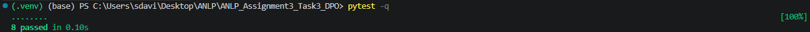

# Direct Preference Optimization (DPO) Objective

This repository contains the completed implementation of the Direct Preference Optimization (DPO) loss function in `src/dpo_objective.py`.

## 1. Setup Note
To ensure that the `pytest -q` command successfully discovered the `src` module without raising `ModuleNotFoundError` or `ImportError`, I created an empty `conftest.py` file in the root directory. This automatically added the project root to the Python path during test collection.

## 2. Test Output
Below is the output confirming that the DPO objective was implemented correctly and passed all tests:



## 3. Toy Experiment Output

Below is the output generated by running the toy preference dataset through the implemented objective:

```
(.venv) (base) PS C:\Users\sdavi\Desktop\ANLP\ANLP_Assignment3_Task3_DPO> python run_experiment.py --data data/toy_preferences.jsonl --beta 0.5
Loaded 12 preference pairs
beta: 0.5
mean DPO loss: 0.6371
preference accuracy from DPO logits: 0.583

Per-example diagnostics:
ex01: logit= 0.350, loss= 0.533, prompt=Explain why RLHF can be unstable.
ex02: logit= 0.250, loss= 0.576, prompt=What is Direct Preference Optimization?
ex03: logit=-0.050, loss= 0.718, prompt=Summarize the main advantage of pairwise preference training.
ex04: logit= 0.400, loss= 0.513, prompt=Why keep a reference policy in DPO?
ex05: logit= 0.300, loss= 0.554, prompt=What does beta control in DPO?
ex06: logit=-0.075, loss= 0.731, prompt=Define a chosen response in preference data.
ex07: logit= 0.300, loss= 0.554, prompt=Explain why scalar reward RL can be difficult for language models.
ex08: logit=-0.150, loss= 0.771, prompt=What is a rejected response?
ex09: logit= 0.350, loss= 0.533, prompt=Why might DPO be easier to implement than PPO-based RLHF?
ex10: logit=-0.125, loss= 0.758, prompt=What is the intuition behind the DPO objective?
ex11: logit=-0.250, loss= 0.826, prompt=What does a negative DPO margin suggest?
ex12: logit= 0.250, loss= 0.576, prompt=How does DPO use preference pairs?
```

## 4. Conceptual Answers
**What does a positive DPO logit mean?**

A positive DPO logit indicates that the current policy favors the chosen (preferred) response over the rejected response more strongly than the reference policy does.

**Why does DPO compare the current policy against a reference policy?**

The reference policy acts as an anchor. By comparing the current policy against it, DPO implicitly applies a Kullback-Leibler (KL) divergence penalty. This prevents the model from drastically degrading its language quality or hacking the reward by drifting too far from its original pre-trained distribution.

**What does the beta parameter control?**

The beta parameter acts as a temperature scale that controls how strongly the objective penalizes deviations from the reference policy. A higher beta enforces stricter adherence to the reference model, while a lower beta allows the policy to shift more freely to satisfy preference pairs.

**Pick one example with a low loss and one example with a high loss. Explain the difference.**

- **Low Loss Example (ex04, logit = 0.400, loss = 0.513):** The model produced a high positive logit, meaning the current policy strongly preferred the chosen response over the rejected response (relative to the reference policy). Because the policy's behavior already aligns well with the ground truth preference, the objective is largely satisfied, resulting in a low loss and a smaller gradient update.  

- **High Loss Example (ex11, logit = -0.250, loss = 0.826):** The model produced a negative logit, meaning the current policy still favors the rejected response too much compared to the reference policy[cite: 6]. Because this directly conflicts with the ground truth preference, the objective yields a high loss to heavily penalize the model and trigger a larger corrective update[cite: 6].